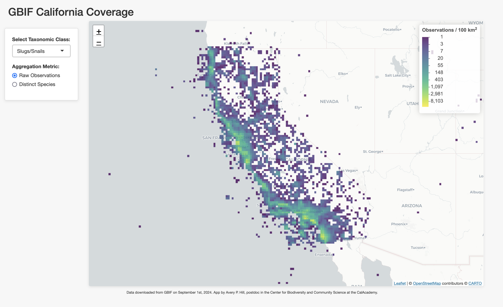

# California GBIF Data Coverage

This repository leverages [DuckDB](https://duckdb.org/) and [Shiny](https://shiny.rstudio.com/) to provide an interactive view of GBIF (Global Biodiversity Information Facility) data coverage across California.

## Web Application

Here's the live webapp: [Link to webapp](https://calacademy-community-science.shinyapps.io/california-gbif-coverage/)

## Screenshot

